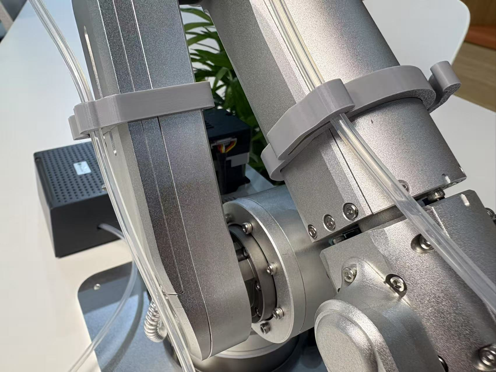
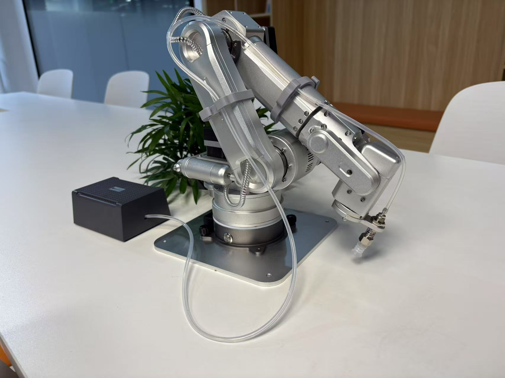

# Harobot Cable Collimator

This project contains 3D model files (STL format) for tracheal and cable clips designed for the HAROBOT robotic arm, as well as related real object images.

## File Structure

- `STL/Clips on big arm of HAROBOT for tracheal and wire-20250701.STL`  
  Model for the tracheal and cable clip used on the big arm of HAROBOT.
- `STL/Clips on small arm of HAROBOT for tracheal and wire-20250701.STL`  
  Model for the tracheal and cable clip used on the small arm of HAROBOT.

## Image Preview

## Instructions

1. Select the appropriate STL file according to your needs (big arm or small arm).
2. Print the model using a 3D printer. PLA or ABS material is recommended.
3. After printing, install the clip on the corresponding part of the HAROBOT robotic arm to secure the tracheal and cables.

